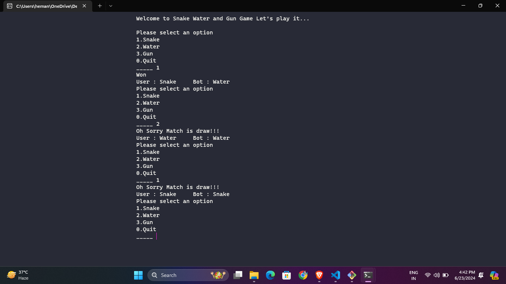

# Snake, Water, and Gun Game

## Introduction

Welcome to the Snake, Water, and Gun game! This is a simple text-based game where the player competes against the computer. The game is similar to Rock, Paper, Scissors, but with the choices Snake, Water, and Gun.

## Game Rules

- **Snake vs. Water**: Snake drinks the Water (Snake wins) 🐍🥤
- **Water vs. Gun**: Gun sinks in Water (Water wins) 🔫🌊
- **Gun vs. Snake**: Gun shoots the Snake (Gun wins) 🐍🔫
- If both players choose the same option, the game is a draw.

## Features

- User-friendly text-based interface. 💻
- High score tracking. 🏆
- Help section to guide new players. ℹ️

## Screenshots

### Loading

### Main Menu


### Gameplay

### Help


## Installation

1. **Clone the repository**:
   ```bash
   https://github.com/Ishwar-meena/Snake-Water-And-Gun-Game-By-C-